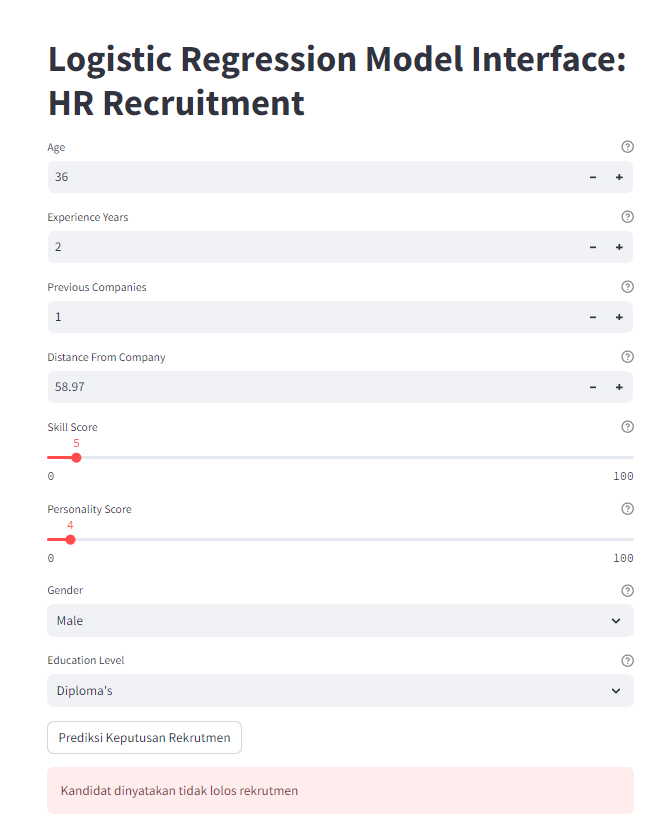
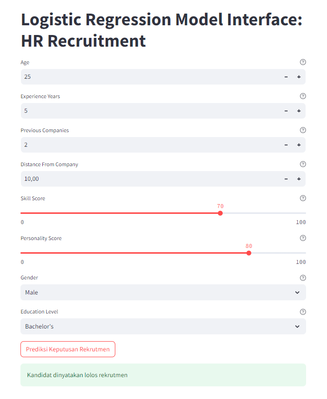

# 🤖 Specura: Integrated AI System for Optimizing Employee Recruitment & Selection

Welcome to **Specura**, an AI-powered recruitment solution designed to streamline hiring processes, minimize bias, and build superior human resources through machine learning. Built as part of a scientific paper for IESTF 2024 by Universitas Singaperbangsa Karawang.

---

## 🧠 Research Flow

Flowchart for Developing a Machine Learning Model for Employee Recruitment

---
## 📌 Problem Statement

In the digital era, manual recruitment is no longer efficient—it's slow, biased, and costly. With hundreds of applicants per job posting, HR departments face difficulty filtering candidates objectively and effectively. The challenge is to design a system that:

- Reduces the time and cost required in recruitment,
- Minimizes human bias during candidate evaluation,
- Ensures alignment with business needs and dynamic industry standards.

---

## 🎯 Objective

The objectives of Specura are:

- ⏱️ **Enhance Efficiency**: Automate recruitment and selection processes with AI.
- 🎯 **Increase Accuracy**: Select the most suitable candidates based on data-driven insights.
- ⚖️ **Minimize Bias**: Reduce subjective judgment from HR decisions.
- 💸 **Reduce Costs**: Save operational expenses in recruitment efforts.

---

## 🧠 Dataset & Features

The dataset used was sourced from Kaggle: [ML for HR: Employee Recruitment Modeling](https://www.kaggle.com/datasets/rabieelkharoua/predicting-hiring-decisions-in-recruitment-data)

Total records: **1,500 samples**  
Target variable: `Decision` (0 = Not Potential, 1 = Potential)

| Feature Name           | Description                                      | Data Type  |
|------------------------|--------------------------------------------------|------------|
| Age                   | Age of the candidate                              | Numeric    |
| Gender                | Gender (Male/Female)                              | Categorical|
| EducationLevel        | Highest education attained                        | Ordinal    |
| ExperienceYears       | Years of professional experience                  | Numeric    |
| PreviousCompanies     | Number of previously worked companies             | Numeric    |
| DistanceFromCompany   | Distance between candidate's home and workplace  | Numeric    |
| SkillScore            | Scored rating of technical skills                 | Numeric    |
| PersonalityScore      | Scored rating of personality assessment           | Numeric    |
| RecruitmentStrategy   | Strategy used to recruit candidate                | Categorical|
| Decision              | Final hiring decision                             | Binary     |

📝 *Note: “RecruitmentStrategy” was excluded from modeling due to low relevance.*

---
## ✅ Conclusion

Specura successfully achieves its goal to:
- Optimize recruitment workflow
- Reduce subjective decision-making
- Recommend best-fit candidates based on ML insights

With 81% model accuracy, Specura is a promising step toward **fairer, faster, and smarter** hiring.

---

## ⚠️ Disclaimer

This project is a prototype built for academic purposes. The data and model performance are subject to further development. For real-world deployment, additional validation, larger datasets, and fairness auditing are recommended.

---

## 🚀 Model Interface: HR Recruitment

   <em>Figure 1. Candidate Not Potential.</em> 
 
   <em>Figure 2. Candidate Potential.</em> 

Try the Specura AI application live via Streamlit:
👉 🔗 [Launch Specura Streamlit App](https://specura.streamlit.app/)

---

## 📬 Contact Me

- 📧 Email: [Radif Ramadan](mailto:radiframadhan@gmail.com)   
- 💼 LinkedIn: [Radif Ramadan](https://www.linkedin.com/in/radiframadan/)  
- 📸 Instagram: [@radifyadika](https://www.instagram.com/radifyadika_/)

⭐ *If you found this project helpful, feel free to star ⭐ the repo and connect with me!*
